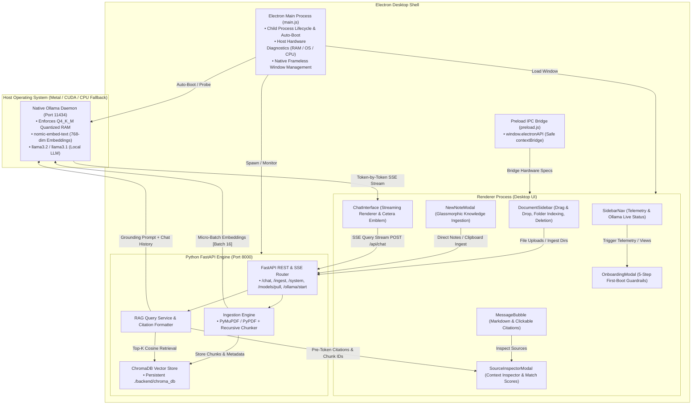

# Cetera — Privacy-First Local Document Intelligence Desktop App

[](https://opensource.org/licenses/MIT)
[-cyan.svg)](#system-architecture)
[](#key-competitive-advantages)
[](#memory-engineering--8gb-vram-optimization)
[](#tech-stack)

A native desktop application designed for privacy-conscious professionals (legal, finance, medical, enterprise) that enables **secure, 100% private semantic search and chat over local documents**. 

The application wraps a Next.js / React UI, a Python FastAPI orchestrator, and a local ChromaDB vector store into a unified desktop shell. It natively leverages the user's host hardware by hooking directly into the host machine's native Ollama application for maximized AI performance.

**Zero external telemetry. Zero cloud API keys. Zero cloud data exfiltration.**

---

## System Architecture



---

## ⚡ Non-Technical Onboarding & Hardware Guardrails

To guarantee a zero-friction experience for non-technical users and protect office laptops lacking dedicated GPUs, the software executes an automated **5-step first-boot sequence**:

```text
[ User Launches Cetera for the First Time ]
                │
                ▼
[ Step 1: Detect Host Hardware & Resources ]
Checks available RAM via psutil & Electron OS bridge. Verifies OS type.
Confirms 8GB VRAM / CPU fallback safety guardrails.
                │
                ▼
[ Step 2: Check for Native Ollama ]
Is Ollama installed and running?
  ├── NO  ──► App auto-detects path to boot daemon or provides 1-click download.
  └── YES ──► App connects directly to host daemon on port 11434.
                │
                ▼
[ Step 3: Enforce Quiet Configuration ]
Enforces local loopback policy (127.0.0.1:11434) with zero cloud telemetry.
                │
                ▼
[ Step 4: Verify Models & Lazy Pull ]
Checks presence of 'nomic-embed-text' and 'llama3.2'.
  └── If missing ──► React UI reveals animated progress bar:
                     "Configuring Secure Local AI Engine..."
                │
                ▼
[ Step 5: Route & Launch ]
App opens to Cetera home workspace with real-time streaming intelligence.
```

---

## Key Competitive Advantages

- **Zero-Configuration Desktop UX**: No Docker setups, WSL configurations, or terminal commands for the end user. It launches and functions like a standard desktop application.
- **Maximal Native Performance**: By hooking directly into the host machine's native Ollama application, the software taps directly into Apple Silicon (Metal API) or Windows NVIDIA GPUs (CUDA) without virtualization bottlenecks.
- **Low-End Hardware Resilience**: Using a 4-bit quantized 3B model (`llama3.2`) coupled with token-by-token streaming guarantees a smooth, readable 15–30 tokens/sec generation speed even on standard office laptops running on pure CPU.
- **Absolute Privacy & Compliance**: Zero document metadata, text chunks, or AI prompts ever leave the local machine, satisfying strict legal, healthcare, and financial compliance rules.

---

## Tech Stack

| Layer | Technology | Description |
| :--- | :--- | :--- |
| **Desktop Shell** | Electron 33 | Native desktop window, OS hardware bridge, child process manager |
| **Frontend UI** | Next.js 16 (App Router), React 19, TypeScript | High-performance client components, responsive slide-out drawers |
| **Styling & Motion** | Tailwind CSS v4, Lucide React | Glassmorphic dark theme (`#060607`), glowing violet accents (`#614DFF`) |
| **Backend API** | FastAPI, Uvicorn, Pydantic v2 | Asynchronous Python REST & SSE endpoints, hardware telemetry |
| **Vector Store** | ChromaDB (Persistent) | Local file-backed HNSW cosine vector index at `./backend/chroma_db` |
| **Document Processing** | PyMuPDF, PyPDF, LangChain Text Splitters | Dual-pass PDF extraction, recursive chunking (800 chunk size / 100 overlap) |
| **Local AI Daemon** | Native Ollama (`http://127.0.0.1:11434`) | Host AI daemon running `llama3.2` and `nomic-embed-text` |

---

## Directory Structure

```text
/local-rag-agent
├── /electron                       # Electron Desktop Shell
│   ├── main.js                     # Main process: lifecycle, window, backend process manager
│   └── preload.js                  # Context-isolated bridge (window.electronAPI)
├── /frontend                       # Next.js 16 TypeScript application
│   ├── /app                        # App Router (page.tsx, layout.tsx, globals.css)
│   ├── /components                 # Modular UI Components
│   │   ├── SidebarNav.tsx          # Navigation bar with live Ollama & hardware telemetry
│   │   ├── OnboardingModal.tsx     # 5-Step First-Boot & Hardware Guardrails Wizard
│   │   ├── ChatInterface.tsx       # Minimalist chat screen with dynamic greeting
│   │   ├── MessageBubble.tsx       # Markdown message bubble with clickable citation pills
│   │   ├── DocumentSidebar.tsx     # Slide-out document manager, dropzone & folder indexer
│   │   ├── NewNoteModal.tsx        # Direct text note & clipboard ingestion modal
│   │   ├── SourceInspectorModal.tsx# Slide-in source context inspection drawer
│   │   └── CeteraLogo.tsx          # Canonical planetary logo & orbit animations
│   └── /lib                        # Frontend utilities, types & SSE API client
│       ├── api.ts                  # Fetch wrappers, hardware query & SSE streaming reader
│       └── types.ts                # TypeScript data contracts & models
├── /backend                        # FastAPI Python backend
│   ├── main.py                     # Application entry point with CORS configuration
│   ├── /api                        # REST routes & endpoints
│   │   └── routes.py               # /chat, /ingest, /system, /models/pull, /ollama/start, /clear
│   ├── /services                   # Business logic and processing services
│   │   ├── ingestion_service.py    # Multi-format document parser & chunker
│   │   ├── ollama_service.py       # Local Ollama client (health, pull stream, chat)
│   │   └── rag_service.py          # Grounded RAG prompt constructor & citation resolver
│   ├── /database                   # Data layer
│   │   ├── vector_store.py         # ChromaDB persistence & similarity search client
│   │   └── schemas.py              # Pydantic request & response schemas
│   ├── /tests                      # Automated unit tests
│   │   └── test_rag_pipeline.py    # Vector store & schema validation tests
│   ├── requirements.txt            # Python dependencies (includes psutil)
│   └── .env.example                # Environment variables template
├── /data                           # User private documents (Gitignored, contains .keep)
├── /example-data                   # Public verification documents (PDF, MD, TXT)
├── package.json                    # Root desktop orchestration & packaging scripts
├── future.md                       # Original product & architecture blueprint
├── CONTEXT.md                      # Progress log & architecture context
└── README.md                       # Technical project documentation
```

---

## API Endpoints

| Method | Endpoint | Description |
| :--- | :--- | :--- |
| `GET` | `/api/status` | System health check, Ollama connection status, models inventory, collection stats |
| `GET` | `/api/system` | Host hardware diagnostics: total/free RAM in GB, CPU cores, OS, and VRAM status |
| `POST` | `/api/ollama/start` | Attempt to launch native Ollama daemon if offline |
| `POST` | `/api/models/pull` | SSE streaming endpoint for downloading required models with live progress |
| `GET` | `/api/documents` | List all indexed documents with chunk and page counts |
| `POST` | `/api/ingest` | Upload `.pdf`, `.md`, `.txt` files or scan folders (`data` / `example-data`) |
| `POST` | `/api/ingest/text` | Direct ingestion of plain-text notes and clipboard summaries |
| `POST` | `/api/chat` | SSE streaming endpoint for grounded RAG query generation |
| `DELETE` | `/api/documents/{filename}` | Delete all vector chunks associated with a specific file |
| `DELETE` | `/api/clear` | Clear the entire ChromaDB collection and wipe indexed documents |

---

## Quickstart Guide

### 1. Prerequisites
1. **Ollama**: Download and install from [ollama.com](https://ollama.com).
2. **Pull Required Models** (or let the app pull them automatically during onboarding):
   ```bash
   ollama pull nomic-embed-text
   ollama pull llama3.2
   ```
3. **Runtime**: Python 3.10+ and Node.js 18+.

---

### 2. Desktop Application Mode (Recommended)

1. **Install Root Dependencies**:
   ```bash
   npm install
   ```
2. **Install Frontend Dependencies**:
   ```bash
   cd frontend && npm install && cd ..
   ```
3. **Install Backend Dependencies**:
   ```bash
   cd backend && pip install -r requirements.txt && cd ..
   ```
4. **Launch Desktop App**:
   ```bash
   npm run dev:desktop
   ```
   *This concurrently boots the FastAPI backend, the Next.js dev server, and opens the native Cetera Electron desktop window.*

---

### 3. Standalone Web Mode (Alternative)

If you prefer to run the system in a standard web browser:

**Terminal 1 (Backend):**
```bash
cd backend
python main.py
```
*API running at `http://127.0.0.1:8000` (docs at `http://127.0.0.1:8000/docs`).*

**Terminal 2 (Frontend):**
```bash
cd frontend
npm run dev
```
*Web client running at `http://localhost:3000`.*

---

### 4. Packaging Native Installers

#### Option A: Standalone Turnkey Installer (Zero-Python End Users)
If distributing to users who **do not have Python or pip installed on their machines**, compile the FastAPI + ChromaDB backend into a standalone frozen executable first:

```bash
# 1. Compile backend into standalone binary
cd backend
python -m PyInstaller --noconfirm --onedir --name "backend" --collect-all chromadb --collect-all uvicorn --add-data "services;services" --add-data "database;database" --add-data "api;api" main.py
cd ..

# 2. Build frontend production bundle
npm run build:frontend

# 3. Package desktop installer
npm run pack
```
*Outputs `dist/Cetera Setup 1.0.0.exe` (~393 MB) — a completely standalone installer that bundles Electron, Chromium, Next.js static assets, and the compiled Python backend binary.*

#### Option B: Developer Installer (Uses Host Python)
If packaging for internal team members who already have Python and `requirements.txt` installed:

```bash
# 1. Build frontend bundle
npm run build:frontend

# 2. Package desktop executable
npm run pack
```
*Outputs `dist/Cetera Setup 1.0.0.exe` (~84 MB).*

---

## Usage & Workflows

1. **First-Boot Guardrails**: On initial launch, Cetera automatically verifies your host hardware, checks native Ollama connectivity, enforces the air-gap, and ensures models are ready.
2. **Open Document Storage**: Click the folder icon in the sidebar or press <kbd>Ctrl</kbd> + <kbd>K</kbd> (<kbd>Cmd</kbd> + <kbd>K</kbd> on macOS).
3. **Index Documents**:
   - **Sample Data**: Click **"Example Dataset"** to load the sample documents from `/example-data`.
   - **Local Folder**: Click **"Local Folder"** to scan and ingest documents from `/data`.
   - **Drag & Drop**: Drop `.pdf`, `.md`, or `.txt` files directly into the dropzone.
   - **Quick Notes**: Click **"New Note"** (<kbd>+</kbd>) to paste meeting minutes or research summaries directly into vector memory.
4. **Ask Questions**:
   - Type inquiries into the chat bar (e.g. *"What are the core pillars of Local-First RAG?"* or *"Summarize the security policies"*).
   - Watch real-time streaming tokens and click on any citation pill to view the source chunk and similarity confidence percentage in the **Context Inspector**.
5. **System Telemetry**: Click the status indicator at the bottom of the sidebar at any time to reopen the **Hardware & AI Engine Setup** modal.

---

## Verification & Testing

Run the automated backend test suite:
```bash
cd backend
python -m pytest tests
```

Build the frontend for production:
```bash
cd frontend
npm run build
```
