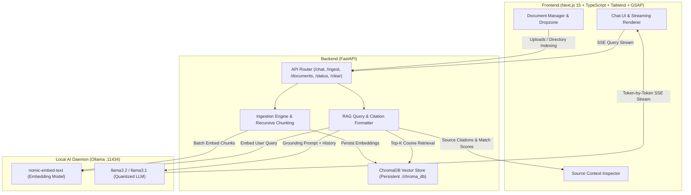

# Local-First Document Intelligence Agent (RAG)

[](https://opensource.org/licenses/MIT)
[](#data-privacy--zero-data-exfiltration-architecture)
[](#memory-management--8gb-vram-optimization)
[](#tech-stack--architecture)

A high-performance, **100% private and locally-hosted Retrieval-Augmented Generation (RAG) system**. Ingest private documents (PDFs, Markdown, plain text), compute local embeddings, and interact with your knowledge base using state-of-the-art local LLMs running entirely on your machine.

**Zero telemetry. Zero external API keys. Zero cloud data exfiltration.**

---

## Architecture Overview



---

## Key Engineering Challenges & Solutions

### 1. Data Privacy & Zero Data Exfiltration Architecture
- **Complete Air-Gapped Operation**: All embedding generation, vector indexing, similarity calculations, and generative token prediction execute strictly over the local loopback interface (`127.0.0.1`).
- **Local Persistent Vector Store**: Documents and vector embeddings are stored inside a local file-backed **ChromaDB** instance (`./backend/chroma_db`), eliminating any external cloud database dependencies.
- **Strict Privacy Invariants**:
  - Personal documents placed in `/data` are protected by strict `.gitignore` rules to guarantee user files can never be committed to version control.
  - A dedicated public `/example-data` folder is provided for testing and verification without exposing confidential user files.

### 2. Memory Management & 8GB VRAM Optimization
Running RAG systems locally on consumer GPUs (e.g. RTX 3060/4060 8GB VRAM) requires careful memory budgeting:
- **Quantized Generation Model**: Optimized for `llama3.2` (3B parameters) or `llama3.1` (8B 4-bit Q4_K_M quantization). Peak autoregressive VRAM consumption remains between **2.2GB and 2.8GB**.
- **Compact High-Quality Embeddings**: Utilizes `nomic-embed-text` (768 embedding dimensions, 8192 token context window) with a VRAM footprint of **<500MB**.
- **Controlled Batch Ingestion**: Document chunks are processed and embedded in micro-batches (batch size: 16) to prevent GPU memory spikes during large PDF processing.
- **Bounded Context Footprint**: Chat history is automatically windowed to the most recent turns, keeping the Key-Value (KV) cache bounded below **1.5GB**.

### 3. Bridging the Frontend and Backend (SSE Streaming & Citations)
- **Server-Sent Events (SSE) Protocol**: Real-time token streaming via FastAPI's `StreamingResponse` using an event-driven payload format (`data: {"type": "token", "token": "..."}`).
- **Pre-Token Citation Dispatch**: The backend sends the retrieved citations, chunk IDs, page numbers, and cosine similarity scores (`{"type": "citations", "data": [...]}`) **immediately** before the first LLM token is generated.
- **Interactive Context Inspector**: Users can click any citation pill on assistant messages to open the **Source Context Inspector**, revealing the exact grounded text chunk, source document, page number, and similarity confidence percentage.

---

## Tech Stack

| Layer | Technology | Purpose |
| :--- | :--- | :--- |
| **Frontend** | Next.js 15 (App Router), TypeScript | Ultra-responsive UI with server and client components |
| **Styling & Motion** | Tailwind CSS v4, GSAP | Dark glassmorphic aesthetic, micro-animations, and drawer transitions |
| **Backend** | FastAPI, Uvicorn | High-throughput asynchronous Python REST & SSE server |
| **Vector Database** | ChromaDB (Persistent) | Local file-backed HNSW cosine vector index |
| **RAG Orchestration** | LangChain / Python services | Multi-format parsing, recursive text splitting, prompt grounding |
| **LLM Engine** | Ollama (`http://localhost:11434`) | Local execution of `llama3.2` and `nomic-embed-text` |

---

## Directory Structure

```text
/local-rag-agent
├── /frontend               # Next.js 15 TypeScript application
│   ├── /app                # App Router (page.tsx, layout.tsx, globals.css)
│   ├── /components         # Header, ChatInterface, MessageBubble, DocumentSidebar, SourceInspector
│   └── /lib                # API fetching client (SSE stream reader) and TypeScript types
├── /backend                # FastAPI Python application
│   ├── main.py             # FastAPI entry point & CORS configuration
│   ├── /api                # REST routes (/chat, /ingest, /documents, /status, /clear)
│   ├── /services           # Ollama client, Document Ingestion, and RAG streaming
│   ├── /database           # ChromaDB vector store client & Pydantic schemas
│   ├── requirements.txt    # Python dependencies
│   └── .env.example        # Environment variable templates
├── /data                   # Private document folder (Gitignored, contains .keep)
├── /example-data           # Public sample documents (Markdown, TXT, PDF) for verification
├── CONTEXT.md              # Living architecture tracking & development progress log
└── README.md               # Technical project documentation
```

---

## Quickstart Guide

### 1. Prerequisites
1. **Ollama**: Download and install from [ollama.com](https://ollama.com).
2. **Pull Local Models**:
   ```bash
   # Pull embedding model (768-dim, <500MB VRAM)
   ollama pull nomic-embed-text

   # Pull generation model (3B parameters, ~2.2GB VRAM)
   ollama pull llama3.2
   ```
3. **Python 3.10+** and **Node.js 18+**.

---

### 2. Backend Setup
1. Navigate to the backend folder:
   ```bash
   cd backend
   ```
2. Install dependencies:
   ```bash
   pip install -r requirements.txt
   ```
3. Start the FastAPI server:
   ```bash
   python main.py
   ```
   *The backend will start at `http://127.0.0.1:8000` (API docs at `http://127.0.0.1:8000/docs`).*

---

### 3. Frontend Setup
1. Navigate to the frontend folder in a new terminal:
   ```bash
   cd frontend
   ```
2. Install dependencies:
   ```bash
   npm install
   ```
3. Run the development server:
   ```bash
   npm run dev
   ```
4. Open [http://localhost:3000](http://localhost:3000) in your browser.

---

### 4. Ingestion & Testing the Pipeline
1. Open the web interface at `http://localhost:3000`.
2. Click **"Documents"** in the top-right header to open the Document Store sidebar.
3. Click **"Load Example Data"** to automatically index the sample documents in `/example-data`.
4. Ask a question such as:
   - *"What are the core pillars of Local-First RAG?"*
   - *"How is memory managed within 8GB VRAM limits?"*
   - *"Summarize Project Falcon's private data policy."*
5. Inspect the generated answer with inline citations and click any citation pill to view the exact retrieved chunk in the **Context Chunk Inspector**.
